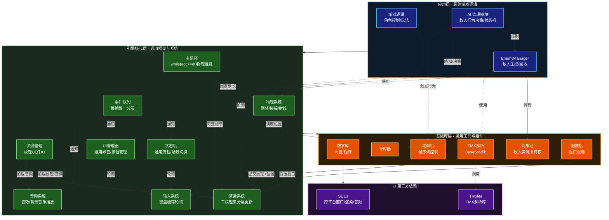

```mermaid
flowchart TD
    %% 深色背景样式
    classDef app fill:#1A237E,stroke:#64B5F6,stroke-width:2px,color:#FFFFFF
    classDef engine fill:#1B5E20,stroke:#81C784,stroke-width:2px,color:#FFFFFF
    classDef base fill:#E65100,stroke:#FFB74D,stroke-width:2px,color:#FFFFFF
    classDef third fill:#4A148C,stroke:#CE93D8,stroke-width:2px,color:#FFFFFF

    subgraph L1 [应用层 - 具体游戏逻辑]
        direction LR
        Game["游戏逻辑<br/>角色控制/玩法"]
        EnemyMgr["EnemyManager<br/>敌人生成/回收"]
        AI["AI 管理模块<br/>敌人行为决策/状态机"]
    end

    subgraph L2 [引擎核心层 - 通用框架与系统]
        direction LR
        Core["主循环<br/>while(acc>=dt)物理推进"]
        Renderer["渲染系统<br/>三纹理集分层更新"]
        Physics["物理系统<br/>刚体/碰撞/射线"]
        Event["事件队列<br/>每帧统一分发"]
        Input["输入系统<br/>键盘缓存轮询"]
        Resource["资源管理<br/>纹理/文件IO"]
        Audio["音频系统<br/>音效/背景音乐播放"]
        FSM["状态机<br/>通用流程/场景切换"]
        UI["UI管理器<br/>通用界面/按钮管理"]
    end

    subgraph L3 [基础库层 - 通用工具与组件]
        direction LR
        Math["数学库<br/>向量/矩阵"]
        Timer["计时器"]
        Pool["对象池<br/>敌人实例所有权"]
        TMX["TMX解析<br/>Base64/Zlib"]
        Animation["动画机<br/>帧序列控制"]
        Camera["摄像机<br/>视口跟随"]
    end

    subgraph L4 [🔌 第三方依赖]
        direction LR
        SDL3["SDL3<br/>跨平台窗口/渲染/音频"]
        Tmxlite["Tmxlite<br/>TMX解析库"]
    end

    %% 层间垂直依赖
    L1 --> L2 --> L3 --> L4

    %% 关键数据流
    Core -.->|固定步长| Physics
    Core -.->|可变帧率| Renderer

    Game -.->|轮询| Input
    FSM -.->|轮询| Input
    UI -.->|轮询| Input

    Event -.->|通知| FSM
    Event -.->|通知| UI
    Event -.->|通知| Audio

    Physics -.->|读取位置| Animation
    Animation -->|提交纹理+位置| Renderer

    EnemyMgr -->|持有| Pool
    EnemyMgr -.->|使用| Animation
    EnemyMgr -.->|使用| Physics

    AI -->|控制| EnemyMgr
    AI -.->|感知/决策| Physics
    AI -.->|触发行为| Animation

    Resource -->|加载纹理/音频| Renderer
    Resource -->|加载音频| Audio
    TMX -.->|调用| Tmxlite
    Camera -->|设置视口| Renderer

    %% 应用样式
    class Game,EnemyMgr,AI app
    class Core,Renderer,Physics,Event,Input,Resource,Audio,FSM,UI engine
    class Math,Timer,Pool,TMX,Animation,Camera base
    class SDL3,Tmxlite third

    %% 子图背景色
    style L1 fill:#0D1B2A,stroke:#64B5F6,stroke-width:2px,color:#FFFFFF
    style L2 fill:#1B2A1E,stroke:#81C784,stroke-width:2px,color:#FFFFFF
    style L3 fill:#2E1C0A,stroke:#FFB74D,stroke-width:2px,color:#FFFFFF
    style L4 fill:#1E0F2E,stroke:#CE93D8,stroke-width:2px,color:#FFFFFF
```